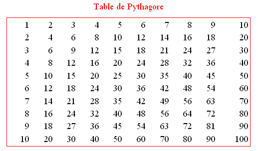

# M2105 - TD1 : Introduction PHP
> durée : 2h

## Exercice 1 

**(Inclusion de pages PHP : factorisation du code / modularité)**

On reprend le premier site réalisé au TP n°5 de M1106. Il comporte 3 pages HTML avec le code suivant pour chaque page i, i allant de 1 à 3.

``` html
<!DOCTYPE html>
<html lang="fr">
<head>
    <meta charset="utf-8">
    <link rel="stylesheet" href="site.css">
    <title> Mon Site </title>
</head>
<body>
 
<div id="titre"> <p> Le titre du Site </p> </div>

<div id="soustitre"> <p> Quelque chose sous le titre </p> </div>

<div id="navgauche">
  <ul>
    <li><a href="page1.html">Page 1</a></li>
    <li><a href="page2.html">Page 2</a></li>
    <li><a href="page3.html">Page 3</a></li>
  </ul>
</div>

<div id="navcorps"> <p> Contenu lié à la page n°i </p> </div>

<div id="pieddepage"> <p> Blabla en bas de page </p> </div>

</body>
</html>
```

**Question 1.1 :** Pourquoi faut-il factoriser le code ? 

**Question 1.2 :** Écrire le contenu de toutes les pages HTML et PHP permettant de factoriser ce site. Il vous faut donc créer des pages contenant du code commun à plusieurs pages et les inclure avec la fonction PHP include quand nécessaire.

**Question 1.3 :** Toutes les pages créées ont-elles vocation à s'afficher dans le navigateur via leur url ?


## Exercice 2  

- Quel est le code HTML généré par les script PHP suivant ?

``` php
<?php

$a = 12;
$b = "livre";

echo "<p> $a $b </p>"; 
echo '<p> $a $b </p>';
echo "<p> \$a contient $a.</p>\n";
var_dump($b);

$t=array("prenom"=>"Emile","nom"=>"Durant");
$t[]="poisson";

echo "<ul>";
foreach($t as $k=>$v)
    echo "<li> $k => $v </li>";
echo "</ul>\n";
print_r($t);

?>
```

- En déduire ce qui est affiché dans un navigateur


## Exercice 3 

- Écrire le code PHP/HTML/CSS permettant de réaliser le tableau suivant (il s'agit de la table de multiplication des nombres de 1 à 10).

 

- Pour cela vous complèterez le code suivant (la légende est écrite en rouge, la bordure du tableau est rouge aussi)

``` html
<table style="border:                                ; text-align: center; width: 40%; margin: 10px auto;">

<caption style="color:             ; text-align:                    ">Table de Pythagore</caption>

  <?php
    for (                                               ) {
  ?>
      <tr style="text-align:              ;">
        <?php
           for (                               ) {
        		echo                                        ;
           }
        ?>
      </tr>
  <?php
    }
  ?>
</table>
```


## Exercice 4  
**(Gestion des formulaires)**

**Question 4.1 :** Qu'affiche dans un navigateur le code suivant :

``` html
<form method="post" action="form_action.php">
  <fieldset>
		<legend>Informations sur vous</legend>
		<label for="nom">Nom</label> :
		<input type="text" name="nom" id="nom" />
		<label for="prenom">Prénom</label> :
		<input type="text" name="prenom" id="prenom" value="Toto"/>
		<hr />
		<label for="pseudo">Pseudo</label> :
		<input type="text" name="pseudo" id="pseudo" placeholder="Ex : progtr" size="10" maxlength="10"/>
		<label for="pass">Mot de passe</label> :
		<input type="password" name="pass" id="pass" />
		<hr />
		<input type="checkbox" name="newsletter" id="newsletter" value="news"/>
		<label for="newsletter">Recevoir notre newsletter</label>
		<hr />
		<input type="radio" name="sexe" id="sexe" value="homme"/>
		<label for="homme">Homme</label>
		<input type="radio" name="sexe" id="sexe" value="femme"/>
		<label for="femme">Femme</label>
		<hr />
		<label for="photo">Photo</label> :
		<input type="file" name="photo" id="photo"/>
		<hr />
		<label>Couleur préférée</label> :
		<select name="couleurs[]">
		  <option value="vert">Vert</option>
		  <option value="bleu" selected="selected">Bleu</option>
		  <option value="rouge">Rouge</option>
		  <option value="jaune">Jaune</option>
		</select>
		<hr />
		<label>Sports pratiqués</label> :
		<input type="checkbox" name="sports[]" value="football" />Football
		<input type="checkbox" name="sports[]" value="rugby" checked="checked"/>Rugby
		<input type="checkbox" name="sports[]" value="golf" />Golf
		<input type="checkbox" name="sports[]" value="jogging" />Jogging	
		<input type="checkbox" name="sports[]" value="autre" />Autre
		<hr />
		<label for="bouton">Un bouton</label> :
		<input type="button" name="bouton" id="bouton" value="Cliquez ici" />
		<hr />
		<label for="init">Réinitialiser le formulaire</label> :
		<input type="reset" name="init" id="init" />
		<hr />
		<label for="description">Description</label> : <br />
		<textarea rows="10" cols="50" name="description" id="description"></textarea>
		<hr />
		<label for="soumission">Soumission</label> :
		<input type="submit" name="soumission" id="soumission" />
  </fieldset>
</form>
```

**Question 4.2 :** Indiquer le code PHP permettant dans la page PHP action du formulaire de mettre dans la variable ```$nom``` le nom saisi dans le formulaire. Que contient cette variable si rien n'a été saisi dans le formulaire ?

**Question 4.3 :** Qu'en est-il pour les champs newsletter et sexe ? En quoi la fonction isset PHP peut être utile ?

**Question 4.4 :** Ecrire le code PHP/HTML permettant d'afficher la liste des sports pratiqués dans une liste.  

## Exercice 5  
**Convertisseur**

**Question 5.1 :** Dessiner le formulaire issu du code suivant :

``` html
<form action="convert_action.php" method="post">
	<h1>Convertisseur Euros/Dollars</h1>
	<p>Euros vers Dollars : <input type="radio" name="sens" value="to_dol" /></p>
	<p>Dollars vers Euros : <input type="radio" name="sens" value="to_eur" /></p>
	<p>Valeur : <input type="text" name="val" /></p>
	<p>
	<input type="submit" value="Valider" />
	<input type="reset" value="Reset"/>
	</p>
</form>
```

**Question 5.2 :** Ecrire la page ```convert_action.php```, l'URL action de ce formulaire, contenant un script PHP qui va convertir la valeur saisie dans le sens précisé. 

:::tip  Exemple 
à la date du 27 mars 2014, 1 euro vaut 1.3786 dollar, et 1 dollar vaut 0.7254 euro, donc si la valeur saisie est 100 et le sens de conversion demandé est "dollars vers euros", alors le résultat doit être un texte de la forme "100 dollars valent 72,54 euros à la date du 27 mars 2014".
:::