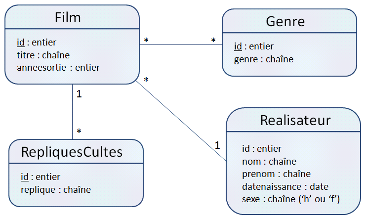

# M2105 - TD2 : Introduction à PHP avec PostgreSQL
> durée : 2h




Dans une base de données PostgreSQL, on considère le schéma film contenant les 5 tables suivantes avec leurs attributs entre parenthèse :

``` sql
genre (id, genre)
realisateur (id, nom, prenom, datenaissance, sexe)
film (id, titre, anneesortie, idrealisateur=>realisateur(id))
genrefilm (id, idfilm=>film(id), idgenre=>genre(id))
repliquescultes (id, replique, idfilm)
```

## Exercice 1 

 Créer la page **```genre_liste.php```** permettant d'afficher la liste des genres de film contenus dans la base. On supposera le serveur PostgreSQL comme étant **iut-rt**, votre base porte le nom de votre **login**.
 
 
## Exercice 2

Factoriser dans un fichier **```connexion.php```** la ligne relative à la connexion à la base et la ligne permettant d'exécuter les requêtes sur le schéma **film**.

## Exercice 3 
 
Modifier alors votre fichier **```genre_liste.php```** pour qu'il utilise le fichier **```connexion.php```**. À quoi va servir cette factorisation ?

## Exercice 4 
1. Donner une requête SQL permettant d'ajouter le genre **Policier**. 
2. Dessiner un formulaire permettant l'ajout d'un genre. 
3. Écrire une page simple le réalisant (uniquement la partie formulaire). 
4. Écrire la page action.


## Sessions


Au TP n°2 vous étendrez ces pages simples en utilisant les sessions, ce qui vous permettra de gérer les champs non remplis par exemple pour redemander l'information sur la page du formulaire.

:::tip Rappel
le mécanisme des sessions permet de garder en mémoire des informations entre les pages. En PHP on utilise la super globale **```$_SESSION```**. 
:::

## Exercice 5

(Non corrigée en TD, à faire avant TP n°2)

1. Donner une requête SQL permettant d'ajouter un réalisateur (vous complétez les champs nécessaire comme vous voulez) 
2. Dessiner un formulaire permettant cet ajout (champs de type "text" pour nom et prénom, menus sélection pour année, mois et jour, bouton radio pour le sexe) (voir cours et TD n°1).
3. Écrire une page simple le réalisant (uniquement la partie formulaire).  
4. Écrire la page action.
