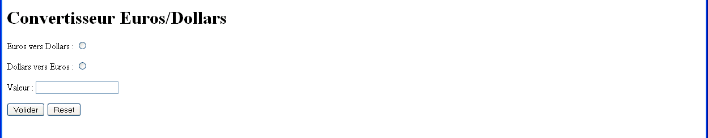
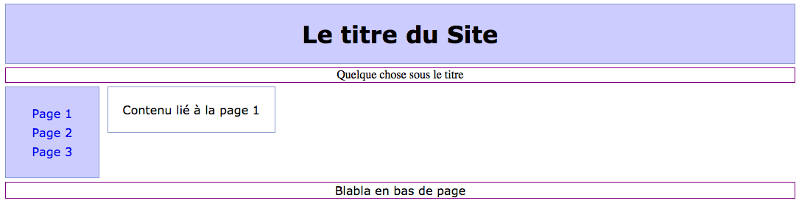
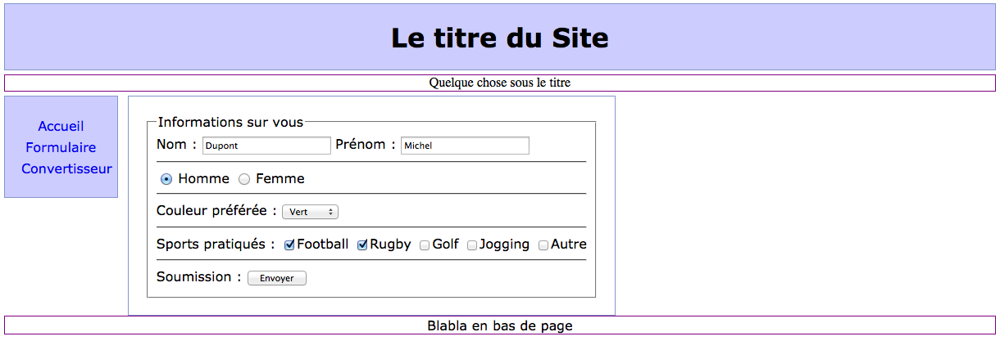
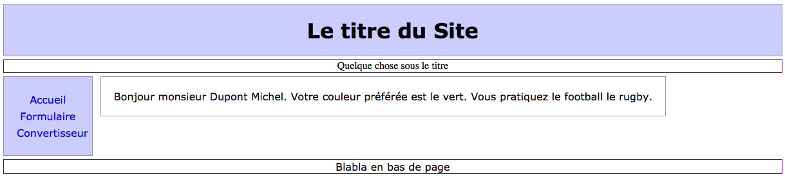
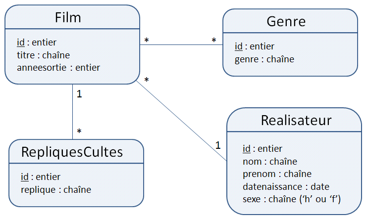
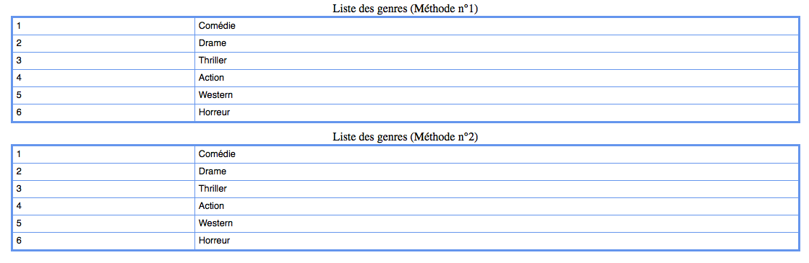
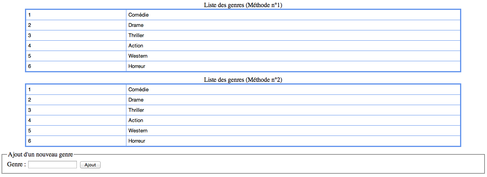

# M2105 - TP1 : Introduction à PHP
> durée : 8h

## Objectifs

- Savoir développer des pages web dynamiques simples avec le langage PHP aux standards HTML 5 et CSS 3.
- Savoir interagir avec une base PostgreSQL notamment avec des formulaires. 

## Environnement de travail et organisation du TP
- Une machine virtuelle Linux (Ubuntu) ou votre machine personnelle avec un serveur LAPP/WAPP (Linux/Windows Apache PHP PostgreSQL)
	- un stack bitnami LAPP/WAPP est accessible [ici pour Linux](https://bitnami.com/stack/lapp) et [ici pour Windows](https://bitnami.com/stack/wapp). À l'IUT, pour Ubuntu, le fichier d'installation a déjà été téléchargé pour vous et se trouve sur iut-rt dans le répertoire ```/opt/donneesTP/M2105/```
		- Copier le fichier sur votre machine
		
				scp votrelogin@iut-rt:/opt/donneesTP/M2105/bitnami-lappstack* cheminSurVotreMachine

		- Pour installer un fichier .run, il suffit de mettre les droits d'exécution dessus, puis d'exécuter le fichier.
		- L'interface Bitnami se lance alors via un script (Quelque chose autour de "manager-linux-x64.run") situé dans votre répertoire d'installation.
		
- Firefox est équipé de l'add-on **Web Developer**.
- Documentations additionnelles au cours : [Manuel PHP](http://www.php.net/manual/fr/)  et [w3schools PHP](http://www.w3schools.com/php/default.asp) 
- Votre editeur de texte préféré (SublimeText, VSCode, PhpStorm ...)
## Une première page de Test

Vérifier votre configuration PHP en utilisant la fonction ```strftime()``` comme vu en cours pour obtenir la date du jour.

``` php
	<!DOCTYPE html>
	<html lang="fr">
	<head>
	    <meta charset="utf-8">
	    <title> Date du jour </title>
	</head>
	<body>
	<?php
	   @setlocale(LC_TIME, 'fr_FR');
	   echo "<p> Au moment de l'exécution de ce script PHP, nous sommes le ".strftime('%A %d %B %Y').".</p>";
	?>
	</body>
	</html>
```
	
- Créer une page ```datedujour.php``` valide W3C dont le corps du HTML (body) contient le code ci-dessous.
- Tester votre page et vérifier l'affichage de la date en français (si ce n'est pas le cas corriger le code).
- Compléter ce code pour afficher également les heures, minutes et secondes.
- Ajouter dans votre code l'affichage d'un paragraphe affichant "Bonne journée !", "Bon après midi !", "Bonne soirée !", ou "Bonne nuit." en fonction de cette heure.
::: tip
la variable ```$h``` étant correctement initialisée :

``` php
	...
	if($h < 12){
	   	echo "<p> Bonne journée !</p>";
	}else if 
	...
```
::: 

## Gestion d'un formulaire

Créer une page ```formulaire.html``` contenant un formulaire en charge de demander à l'utilisateur son nom (champ de type texte), son prénom (champ de type texte), son genre (bouton radio homme/femme), sa couleur préférée (menu sélection entre rouge, vert, bleu, jaune), et ses sports pratiqués (boites à cocher).

>***Aide :***

```php
	<!DOCTYPE html>
	<html lang="fr">
	<head>
	    <meta charset="utf-8">
	    <title> Formulaire </title>
	</head>
	<body>	
	<form method="post" action="formulaire_action.php">
	    <fieldset>
			<legend>Informations sur vous</legend>
			<label for="nom">Nom</label> :
			<input type="text" name="nom" id="nom" />
			<label for="prenom">Prénom</label> :
			<input type="text" name="prenom" id="prenom" />
			<hr />
			<input type="radio" name="genre" id="genre" value="homme"/>
			<label for="homme">Homme</label>
			<input type="radio" name="genre" id="genre" value="femme"/>
			<label for="femme">Femme</label>
			<hr />
			<label>Couleur préférée</label> :
			<select name="couleur">
				<option value="rouge">Rouge</option>
				<option value="vert">Vert</option>
				<option value="bleu">Bleu</option>
				<option value="jaune">Jaune</option>
			</select>
			<hr />
			<label>Sports pratiqués</label> :
				<input type="checkbox" name="sports[]" value="football" />Football
				<input type="checkbox" name="sports[]" value="rugby"/>Rugby
				<input type="checkbox" name="sports[]" value="golf" />Golf
				<input type="checkbox" name="sports[]" value="jogging" />Jogging
				<input type="checkbox" name="sports[]" value="autre" />Autre
			<hr />
			<label for="soumission">Soumission</label> :
			<input type="submit" name="soumission" id="soumission" />
	     </fieldset>
	</form>
	</body>
	</html>
```
	
Créer la page action ```formulaire_action.php``` de ce formulaire en charge d'afficher une synthèse des données saisies. Par exemple Bonjour madame ou monsieur en fonction du genre saisi suivi du nom et prénom. Votre couleur préférée est ..., vous ne pratiquez aucun sport ou les sports suivants ... en fonction des cases cochés.


>***Aide :***

```php
<!DOCTYPE html>
<html lang="fr">
<head>
    <meta charset="utf-8">
    <title> Formulaire Action </title>
</head>
<body>

<?php 
$nom=$_POST['nom'];
$prenom=$_POST['prenom'];
$genre=$_POST['genre'];
$couleur=$_POST['couleur'];
$sports=$_POST['sports'];

echo "<p> Bonjour ";
if($genre=="homme")
	echo "monsieur ";
else if ($genre=="femme")
	echo "madame ";
echo "$nom $prenom. Votre couleur préférée est le $couleur. ";

if(count($sports)==0)
	echo "Vous ne pratiquez aucun sport.</p>";
else {
	echo "Vous pratiquez";
	foreach ($sports as $k => $v)
    	echo " le $v";
	echo ".</p>";
}
?>	

</body>
</html>
```


## Convertisseur Euros/Dollars


Créer une page ```convertisseur.html``` contenant un formulaire composé de :

- une zone d'options permettant de choisir le sens de conversion que l'on désire, dollars vers euros ou l'inverse (boutons radios)
- un champ texte permettant de saisir la valeur que l'on souhaite convertir.



>***Aide :***

```html
<!DOCTYPE html>
<html lang="fr">
<head>
    <meta charset="utf-8">
    <title> Convertisseur </title>
</head>
<body>
<h1>Convertisseur Euros/Dollars</h1>
<form action="convertisseur_action2.php" method="post">
	<p>Euros vers Dollars : <input type="radio" name="sens" id="sens" value="to_dol" /></p>
	<p>Dollars vers Euros : <input type="radio" name="sens" id="sens" value="to_eur" /></p>
	<p>Valeur : <input type="text" name="val" id="val"/></p>
	<p>
		<input type="submit" value="Valider" />
		<input type="reset" value="Reset"/>
	</p>
</form>
</body>
</html>
```


Réaliser la page ```convertisseur_action.php```, l'URL action de ce formulaire, contenant un script PHP qui va convertir la valeur saisie dans le sens précisé.

>***Aide :***

``` php
<!DOCTYPE html>
<html lang="fr">
<head>
    <meta charset="utf-8">
    <title> Convertisseur </title>
</head>
<body>

<h1>Convertisseur Euros/Dollars</h1>

 <?php
 	$k=1.1421;
	if ($_POST['sens']==to_dol){   
	   $init="euros";
	   $fin="dollars";
	 }
	 else {
	   $k=1/$k;
	   $init="dollars";
	   $fin="euros";
	 }
	 $res=$k*$_POST['val'];
	 echo "<p>".$_POST['val']." $init valent $res $fin </p>";
 ?>	

</body>
</html>
```

::: tip Aide
vous pouvez allez chercher le taux sur une autre page
```$k=substr(strstr(file_get_contents("http://www.google.com/finance"),'EUR/USD'),28,6);```
::: 

## Inclusions de pages PHP dans un site


Dans cette partie partie vous allez reprendre l'habillage du site Web créé au [**TP n°4**](https://davidmercier.fr/teaching/M1106/TP/TP4.html) ou [**TP n°5**](https://davidmercier.fr/teaching/M1106/TP/TP52.html)  du module M1106. 

 

À la place des pages ```page1.html```, ```page2.html```, ```page3.html```, vous allez mettre :

- en premier lien du menu une page Accueil affichant la date du jour dans le bloc "navcorps"
- en deuxième lien une page affichant le formulaire précédent dans le bloc "navcorps"
- en troisième lien une page affichant le convertisseur dans le bloc "navcorps"

Par exemple, pour le formulaire :

 

Les pages d'action des formulaires gardent l'habillage du site et seront aussi affichées dans le bloc "navcorps".

 

::: tip Aide
Vous allez devoir utiliser la fonction PHP include
```<?php include 'code_a_inclure.html';?>```
:::

Créer une page ```entete.html``` contenant le début commun à toutes les pages du site. Il sera à inclure au début de toutes les pages du site.

``` html
<!DOCTYPE html>
<html lang="fr">
<head>
    <meta charset="utf-8">
    <link rel="stylesheet" href="site.css">
    <title> Mon Site </title>
</head>
<body>
 
	<div id="titre">
		<p> Le titre du Site </p>
	</div>

	<div id="soustitre">
		<p> Quelque chose sous le titre </p>
	</div>

	<p id="navgauche">
		<ul>
			<li><a href="accueil.php">Accueil</a></li>
			<li><a href="form.php">Formulaire</a></li>
			<li><a href="convert.php">Convertisseur</a></li>
		</ul>
	</p>
```

Créer une page ```pieddepage.html``` contenant le pied de page commun à toutes les pages du site. Il sera à inclure à la fin de toutes les pages du site.

``` php
	<div id="pieddepage">
		<p> Blabla en bas de page </p>
	</div>

</body>
</html>
```
Toutes les pages de votre site (```accueil.php```, ```form.php```, ```form_action.php```, ```convert.php```, ```convert_action.php```) auront la forme suivante.

``` php
<?php include("entete.html"); ?>

<div id="navcorps">

<!-- Code de la page à complèter -->

</div>

<?php include("pieddepage.html"); ?>
```


::: danger Validation
Appeler l'enseignant pour valider cette première étape (Obligatoire).
:::
 
## Interagir avec une base de données PostgreSQL depuis PHP


Dans les données de ce TP se trouve un fichier ```film.sql``` permettant de créer et d'initialiser un schéma film dont le diagramme de classe est illustré sur la figure suivante.

 

Le schéma film contient les 5 tables suivantes :

``` sql
- genre (id, genre)
- realisateur (id, nom, prenom, datenaissance, sexe)
- film (id, titre, anneesortie, idrealisateur=>realisateur(id))
- genrefilm (id, idfilm=>film(id), idgenre=>genre(id))
- repliquescultes (id, replique, idfilm)
``

Insérer ce schéma dans votre base de données, puis créer la page suivante ```genre_liste.php``` permettant d'afficher la liste des genres de film contenus dans la base.

``` php
<!DOCTYPE html>
<html lang="fr">

    <head>
        <meta charset="utf8" />
        <title> Liste des genres </title>
    </head>

    <body>

    <?php
    $conn = pg_connect("host=  dbname=  user=  password= ");
    pg_query($conn, "SET SEARCH_PATH=film,PG_CATALOG");

    $result = pg_query($conn, "SELECT genre FROM genre");

    echo "<p> Liste des genres : </p>";
    echo "<ul>";
    while($ligne = pg_fetch_array($result)){
        echo "<li>".$ligne[0]."</li>\n";
    }
    echo "</ul>\n";

    pg_close($conn);
    ?>

</body>
</html>
```

Compléter la chaîne permettant la connexion à votre base et tester votre page. 

À quoi sert la ligne suivante ?

``` php
pg_query($conn, "SET SEARCH_PATH=film,PG_CATALOG");
```

Factoriser dans un fichier ```connexion.php``` la ligne relative à la connexion à la base et l'initialisation de la variable $conn et la ligne permettant d'exécuter les requêtes sur le schéma film

>Copier ces 3 lignes dans ```connexion.php``` (en complétant la chaîne argument de ```pg_connect```).

``` php
<?php
$conn = pg_connect("host=  dbname=  user=  password= ");
pg_query($conn, "SET SEARCH_PATH=film,PG_CATALOG");
```

>Ne mettez pas le ```?>``` à la fin, il n'est pas obligatoire en PHP et source d'erreur pour la fonction **header** par exemple.


Modifier alors votre fichier ```genre_liste.php``` pour qu'il utilise le fichier ```connexion.php```. À quoi va servir cette factorisation ?


Créer une page ```genre_tab.php``` permettant d'afficher dans un tableau toutes les colonnes de la table genre (id, genre). Vous utiliserez un habillage de tableau similaire à celui employé au **TP n°3 M1106**. Vous avez le fichier ```film.css``` dans les données de ce TP.


>Voir fichier ```exemple_caddie.php``` du cours et fonctions : ```pg_num_rows```, ```pg_num_fields```, ```pg_result```, ```pg_fetch_array```.


``` php
<!DOCTYPE html>
<html lang="fr">

    <head>
        <meta charset="utf8" />
        <title> Liste des genres </title>
        <link rel="stylesheet" href="film.css"/>
    </head>

    <body>

    <?php

    include('connexion.php');

    $result = pg_query($conn, "SELECT * FROM genre");

    $nombreLignes = pg_num_rows($result);
    $nombreColonnes = pg_num_fields($result);

?>

<!-- Méthode n°1 -->
<table>
<caption> Liste des genres (Méthode n°1) </caption>
<?php
for($i = 0; $i < $nombreLignes; $i++){
    echo "<tr>";
    for($j = 0; $j < $nombreColonnes; $j++)
        echo "<td>".pg_result($result, $i, $j)."</td>";
    echo "</tr>\n";
}
?>
</table>

<!-- Méthode n°2 -->
<table>
<caption> Liste des genres (Méthode n°2) </caption>
<?php
while($ligne = pg_fetch_array($result)){
    echo "<tr>";
    for($i = 0; $i < $nombreColonnes; $i++)
        echo "<td>".$ligne[$i]."</td>";
    echo "</tr>\n";
}
?>
</table>

</body>
</html>
```


 


Créer une page ```ajout_genre.php``` affichant dans un premier temps les genres dans un tableau suivis d'un formulaire pour l'insertion d'un nouveau genre.

 

Cet ajout simple peut être rendu plus sophistiqué en vérifiant que le genre n'est pas déjà présent, en faisant attention de toujours écrire les genres avec la même casse (une majuscule suivie de minuscules), en informant l'utilisateur soit de l'ajout soit d'erreur, en n'obligeant pas l'utilisateur à retaper ce qu'il avait mis dans le formulaire


>***Aide*** : ```ajout_genre_simple.php```

``` php
<!DOCTYPE html>
<html lang="fr">

    <head>
        <meta charset="utf8" />
        <title> Liste des genres </title>
        <link rel="stylesheet" href="film.css"/>
    </head>

    <body>

    <?php

    include('connexion.php');

    $result = pg_query($conn, "SELECT * FROM genre");

    $nombreLignes = pg_num_rows($result);
    $nombreColonnes = pg_num_fields($result);

?>

<!-- Méthode n°1 -->
<table>
<caption> Liste des genres (Méthode n°1) </caption>
<?php
for($i = 0; $i < $nombreLignes; $i++){
    echo "<tr>";
    for($j = 0; $j < $nombreColonnes; $j++)
        echo "<td>".pg_result($result, $i, $j)."</td>";
    echo "</tr>\n";
}
?>
</table>

<!-- Méthode n°2 -->
<table>
<caption> Liste des genres (Méthode n°2) </caption>
<?php
while($ligne = pg_fetch_array($result)){
    echo "<tr>";
    for($i = 0; $i < $nombreColonnes; $i++)
        echo "<td>".$ligne[$i]."</td>";
    echo "</tr>\n";
}
?>
</table>

<form method="post" action="ajout_genre_simple_action.php">
     <fieldset>
          <legend> Ajout d'un nouveau genre </legend>
          <label for="genre">Genre</label> :
          <input type="text"  name="genre" id="genre"/>
          <input type="submit" name="ajoutgenre"
                 id="ajoutgenre" value=" Ajout "/>
     </fieldset>
</form>

</body>
</html>
```


>***Aide :*** ```ajout_genre_simple_action.php```

``` php
<?php
$genre=ucfirst(strtolower($_POST['genre']));
$sql="INSERT INTO genre(genre) VALUES ";
$sql.="('$genre');";

include('connexion.php');

pg_query($conn, $sql);
pg_close($conn);

header("Location: ajout_genre_simple.php");
exit();
?>

```


>Pour faire cela, vous aurez besoin des éléments suivants : mécanisme des sessions (```$_SESSION```, ```@session_start()```), pour mettre une chaîne avec une majuscule suivie de minuscules (```ucfirst(strtolower($unechaine))```), pour renvoyer la main à une page page.php (```header("Location: page.php");```), pour vérifier qu'une variable existe (```isset($variable);```).

## Création de votre site web personnel PHP/PostgreSQL


Réaliser un site web personnel sur ce que vous voulez : votre page personnelle, un hobby, une association fictive ou non, ...

- Le site doit comprendre au moins 3 pages dont un formulaire et son traitement.
- Les informations du site sont stockées dans une base de données PostgreSQL. Deux ou trois tables sont suffisantes pour votre site.
- Des informations issues de la base doivent être affichées sur le site.
- Des informations issues du site (formulaire) doivent pouvoir être insérées dans la base.
- Vous devez mettre en avant vos compétences PHP/postgreSQL acquises.

Barème à titre indicatif

- Site (8 points) :
	- Menu et gestion des blocs (3 points) (habillage différent de celui de ce TP),
	- Clarté code (respect W3C) et factorisation (4 points) En particulier : les identifiants de connexion à la base se trouvent dans un seul fichier,
	- Orthographe (1 point).
- Fonctionnalités du site pour l'insertion dans la base ou la consultation (12 points) :
	- Affichage d'informations de la base sur le site et dans un formulaire via un menu select par exemple,
	- Insertion d'informations dans la base à partir du site. Prise en compte de mauvaises saisies,
	- Difficulté du ou des formulaires créés (informations issues de la base dans un champ select, boutons radio, boites à cocher, ...),
	- Qualité de l'affichage sur le site des informations issues de la base (tableau, liste, habillage),
	- Des informations dans la base peuvent être supprimées depuis le site (delete).


::: danger INFO 
Le site sera évalué pendant la troisième séance.
:::
