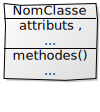
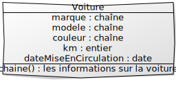
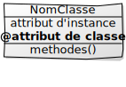
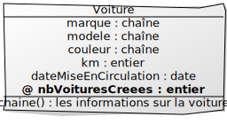
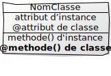
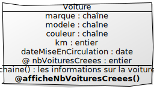
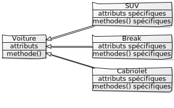
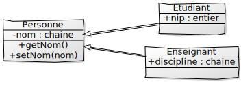

# M2207 - CM1 : Une introduction à la programmation orientée objet avec Java
> durée : 4h

## Qu'est-ce que la programmation objet ?

- C'est une façon de programmer où interviennent des objets.
- Un objet (ou instance) représente un concept
 > Exemple : une voiture, une personne, un entier, une chaîne, une adresse IP
- Une classe déclare l’ensemble des propriétés (attributs et méthodes) d’un ensemble d’objets (ou instances).
 > Exemple (*notez la majuscule au nom de la classe*) : une classe `Voiture`, `Personne`, …
 > Exemple en java : la classe `Integer` (entiers), `String` (chaînes), `InetAddress` (adresse IP), …  

### Exemple : classe `Voiture`
> (représentée sous la forme d’un diagramme de classe)


      

#### Un exemple d’objet (ou instance) de cette classe `Voiture`

| Une Voiture v1 |                           |                 |
|----------------|--------------------------:|:----------------|
|                | **Marque**                | "Peugeot"       |
|                | **Modele**                | "205"           |
|                | **Couleur**               | "grise"         |
|                | **Km**                    | 123450          |
|                | **dateMiseEnCirculation** | "20 avril 1992" |

`v1.chaine()` : retourne une chaîne contenant les informations de v1

#### Avec Java

```java 
public class Voiture {
  public String marque;
  public String modele;
  public String couleur;
  public double km;
  public LocalDate dateMiseEnCirculation;

  public String chaine(){
    return "Voiture :\n" +
            "\t Marque : " + this.marque + "\n" +
            "\t Modèle : " + this.modele + "\n" +
            "\t Couleur : " + this.couleur + "\n" +
            "\t Kilométrage : " + this.km + "\n" +
            "\t Date de mise en circulation : " + this.dateMiseEnCirculation;
  }
}
```

:::warning 
 Il faut ajouter un constructeur aussi pour pouvoir créer des objets. Voir fichiers du cours Voiture.java et TestVoiture.java
:::

::: details Voiture.java
```java
import java.time.LocalDate;

public class Voiture {
  public String marque;
  public String modele;
  public String couleur;
  public double km;
  public LocalDate dateMiseEnCirculation;
  
  /* Constructeur sans argument */
  public Voiture(){
    this.marque = "inconnue";
    this.modele = "inconnu";
    this.couleur = "inconnue";
    this.km = 0;
    this.dateMiseEnCirculation = LocalDate.now();
  }
  
  /* 2e constructeur */
  public Voiture(String marque, String modele, String couleur, int km){
    this.marque = marque;
    this.modele = modele;
    this.couleur = couleur;
    this.km = km;
    this.dateMiseEnCirculation = LocalDate.now();
  }
  
  /* 3e constructeur */
  public Voiture(String marque, String modele, String couleur, int km,
          int annee, int mois, int jour){
    this.marque = marque;
    this.modele = modele;
    this.couleur = couleur;
    this.km = km;
    this.dateMiseEnCirculation = LocalDate.of(annee,mois,jour);
  }
  
    public String chaine(){
      return "Voiture :\n"+
              "\t Marque : "+ this.marque +"\n"+
              "\t Modèle : "+ this.modele +"\n"+
              "\t Couleur : "+ this.couleur +"\n"+
              "\t Kilométrage : "+ this.km +"\n"+
              "\t Date de mise en circulation : "+ this.dateMiseEnCirculation;
    }
}
```
:::


::: details TestVoiture.java
```java
public class TestVoiture {
  public static void main(String[] args) {
    Voiture v1 = new Voiture();
    System.out.println(v1.chaine());
    System.out.println(v1.marque);
    
    Voiture v2 = new Voiture("Peugeot","205","Grise",123450);
    System.out.println(v2.chaine());
    
    Voiture v3 = new Voiture("Peugeot","205","Grise",123450,1992,4,20);
    System.out.println(v3.chaine());
  }
}

```
:::

## Variable d’instance et variable de classe

- Une variable (ou attribut) d’instance est une variable liée à un objet.
> Exemple : la marque d’une voiture
- Une variable (ou attribut) de classe est commune à tous les objets de la classe
> Exemple : le nombre de voitures créées

      


## Méthode d’instance et méthode de classe

- Une méthode d’instance porte sur une instance de la classe.
> Exemple : chaine()
- Une méthode de classe ne porte pas sur une instance en particulier.
> Exemple : afficheNbVoituresCreees()

      


### Avec Java

```java 
public class Voiture {
  public String marque;
  public String modele;
  public String couleur;
  public double km;
  public LocalDate dateMiseEnCirculation;
  public static int nbVoituresCreees;

  public String chaine(){
    return "Voiture :\n" +
            "\t Marque : " + this.marque + "\n" +
            "\t Modèle : " + this.modele + "\n" +
            "\t Couleur : " + this.couleur + "\n" +
            "\t Kilométrage : " + this.km + "\n" +
            "\t Date de mise en circulation : " + this.dateMiseEnCirculation;
  }

  public static void afficheNbVoituresCreees(){
     System.out.println("Il y a" + nbVoituresCreees+ "voiture(s)."); 
  }

}
```
:::tip Info 
Le mot clé **static** est utilisé pour indiquer une instance de classe et une méthode de classe 
:::

:::danger Exercice 
Créer une classe **Personne** (composée par exemple de 2 attributs de classes différentes et d'une méthode) puis deux objets de cette classe.

Faire le diagramme de classe, le programme Java de création de cette classe et un programme Java de test de cette classe
:::


## Portée (Accès) des attributs et méthodes
- Avec le mot clé `public` : accessible partout 
- Avec le mot clé `private` : uniquement accessible dans la classe 

Exemple : modification d'un attribut de la classe `Voiture`
```java
// ne sera accessible que depuis la classe
private String marque; 
// À tester avec Voiture.java et TestVoiture.java	
```


## Héritage

- Une **classe** (dite **fille** ou sous-classe) peut **hériter** d'une autre classe (dite **mère** ou super-classe)
- La classe fille bénéficie alors de toutes les propriétés (attributs et méthodes) de la classe mère, et on peut lui ajouter d'autres propriétés (attributs ou méthodes).
- La classe fille peut aussi redéfinir une méthode héritée de la classe mère.

 



:::tip Notation 
* **-**  Attribut privé
* **+**  Attribut public
::: 

#### Avec Java

:::details Personne.java
```java
public class Personne {
  private String nom; //accès privé
  
  // Constructeur
  public Personne(String nom){
    this.nom = nom;
  }
  
  // Pour modifier le nom
  public void setNom(String nom){
    this.nom = nom;
  }
  
  // Pour accéder au nom
  public String getNom(){
    return this.nom;
  }
}
```
:::
:::details Etudiant.java
```java
public class Etudiant extends Personne {
    int numEtu;
    int annee;

    public Etudiant(String nom, int numEtu){
      super(nom); 
      this.numEtu = numEtu;
    }
}
```
:::
:::details Enseignant.java
```java
public class Enseignant extends Personne{
  public String discipline;
  
  public Enseignant(String nom, String disc){
    super(nom);
    this.discipline = disc;
  }
}

```
:::


:::danger Exercice 
Créer une classe **ordinateur** et des sous-classes possibles avec leurs attributs et méthodes.
:::