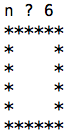
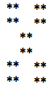

# M2207 - TP1 : Consolidations des bases  de la programmation
> durée : 4h

## Objectif de ce TP
Consolider vos bases de programmation Java.

## Exercice n°1

Réalisez un programme Java `Piece.java` en charge simuler le lancement d'une pièce de monnaie (Pile ou Face).
:::tip
Math.random()` va vous aider (cf **TP n°4 M1207**).
:::
:::tip
Travaillez dans votre répertoire `M2207/TP1`.
:::
:::tip Rappel 
il suffit de créer un générateur de nombre qui est un objet de la classe Random
Par exemple : 
```java 
Random rg = new Random();
```
Puis d'utiliser la méthode d'instance `nextInt(n)` qui retourne un entier compris entre **0** et **n-1** inclus

Par exemple : `rg.nextInt(10)` renverra un nombre entier compris entre 0 et 9 inclus.

Javadoc classe [Random](https://docs.oracle.com/javase/8/docs/api/java/util/Random.html)
:::
Réalisez une nouvelle version du programme `Piece.java` contenant une fonction `public static String pileOuFace()` renvoyant `"Pile"` ou `"Face"` comme une pièce non truquée. 
Testez cette fonction dans votre fonction principale. Créez un tableau contenant 10 lancers.

```java
import java.util.Arrays;
import java.util.Random;

public class Piecev2 {
  
	public static String pileOuFace() {
   		// à faire
	}
   	
   	public static void main(String[] args) {
		// à faire
	}
}
```
:::tip Rappel 
vous pourrez utilisez dans la fonction main la fonction `System.out.println(Arrays.toString(tab));` pour afficher un tableau tab.
Javadoc classe [Arrays](https://docs.oracle.com/javase/8/docs/api/java/util/Arrays.html)
:::


## Exercice n°2

Réalisez un programme Java `Carre.java` permettant l'affichage d'un carré d'étoiles. La longueur **n** du côté est demandée à l'utilisateur. Un exemple est donné ci-dessous (cas n=6).

       

- Créez une fonction `public static String repeteChaine(String ch, int n){...}` en charge de retourner une chaîne répétée **n** fois.

> Par exemple `repeteChaine("*",5)` doit retourner `"*****"`. (Une aide est tout en bas "au pire")

Réalisez un programme Java `Quadrillage.java` permettant l'affichage d'un quadrillage de cases noires (remplies avec le signe `*`) et de cases blanches (remplies d'espaces). Chaque case est de dimension **n x n** (*n* étant demandé à l'utilisateur). Le quadrillage comporte **m x m** cases (*m* sera aussi demandé à l'utilisateur). 

Ci-dessous un exemple avec **n=2** et **m=3**.

       


- Avec la même idée que dans le programme précédent, découpez une tâche complexe en tâches simples. Créez une fonction `public static String ligneCases(int n, int nbc, boolean e){...}` en charge de retourner une chaîne composée d'une ligne du quadrillage composée de **nbc** cases de longueur **n**, si **e** vaut `true` la ligne commence par des étoiles sinon par des espaces. La chaîne finira par un retour à la ligne.

> Par exemple `ligneCases(3,4,true)` doit retourner `"***   ***   \n"` (3 espaces entre les étoiles).

> Autre exemple : `ligneCases(4,2,false)` doit retourner `"    ****\n"` (4 espaces avant les étoiles). (Une aide est tout en bas "au pire")

## Exercice n°3

Dans cet exercice, vous allez créer un programme permettant de simuler un résultat du loto (5 boules numérotées de 1 à 49 suivies de 1 numéro chance entre 1 et 10). Un joueur pourra proposer une combinaison et le programme pourra indiquer les bons numéros.

Pour ce faire, vous allez suivre les étapes suivantes. Dans un programme `Loto.java` :

- Créez une fonction/méthode en charge de retourner le lancer de 5 boules numérotées de 1 à 49 sans remise (cela signifie qu'une fois la boule 11 sortie par exemple, elle ne peut plus être retirée), et d'une boule dont le numéro (dit chance) varie de 1 à 10.

:::tip 
Un tableau d'entiers est une bonne structure de données pour contenir le résultat des 6 boules.
:::
:::tip
`Math.random()` va vous aider.
:::

> La signature de la méthode sera : `public static int[] tirage(){...}`

- Ajoutez une méthode en charge de **retourner** une combinaison valide demandée à un joueur.

> La signature de la méthode sera : `public static int[] combiJ(){ ... }` 

- Créez une méthode en charge d'**afficher** le nombre de bons numéros d'un joueur (bons numéros parmi les 5 boules et bon numéro chance).

> La signature de la méthode sera : `public static void result(int[] comb, int[] combJ){ ... }`

- Testez vos méthodes dans la fonction `main`.

## Synthèse

- Complétez le tableau suivant dans un fichier libreoffice, rtf ou word à rendre avec vos programmes.

| Instruction en pseudo\-code                    | En Java                           |
|------------------------------------------------|-----------------------------------|
| afficher "chaîne"                              | `System.out.println("chaîne");`   |
| afficher sur une ligne "chaîne"                |                                   |
|  a ← 2                                         |                                   |
|  a ← saisir un entier                          |                                   |
|  a ← saisir un réel                            |                                   |
|  a ← saisir une chaîne                         |                                   |
|  si condition alors \.\.\. finsi               |                                   |
|  si condition alors \.\.\. sinon \.\.\. finsi  |                                   |
|  tant que condition faire \.\.\. fintantque    |                                   |
|  pour i allant de 1 à 10 faire \.\.\. finpour  |                                   |
|  a ← un entier aléatoire entre 1 et 10         |                                   |
|  t ← un tableau d'entiers de longueur 10       |                                   |
|  t\.longueur                                   |                                   |
|  t ← \[1,2,3\]                                 |                                   |
|  t ← \[\]                                      |                                   |


:::danger Compte-rendu
À la fin de chaque TP, déposez sur rt-bethune (Moodle) une archive au format zip d'un répertoire à votre nom contenant vos programmes avec un éventuel fichier de commentaires.
:::

:::details  Aide supplémentaire "au pire" (avoir cherché avant !)
```java 
public static String repeteChaine(String ch, int n) {
	String rch = "";
	for(int i=1;i<=n;i++)
		rch = rch + ch;
	return rch;
}
public static String ligneCases(int n, int nbc, boolean e) {
	String ligne = "";
	for(int i=1;i<=nbc;i++){
		if(e)
			ligne = ligne + repeteChaine("*",n);
		else
			ligne = ligne + repeteChaine(" ",n);
		e=!e;
	}
	return ligne+"\n";
}
```
:::