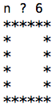
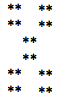
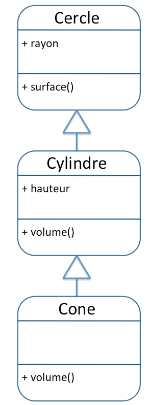
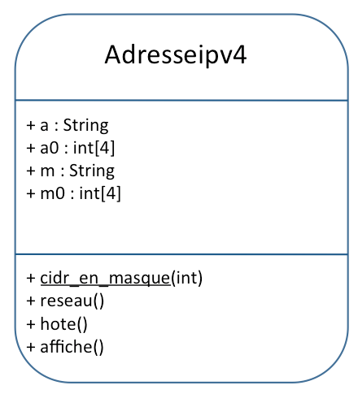

# M3210C - TP1 : Consolidations des bases  de la programmation orientée objets
> durée : 4h

## Objectif de ce TP
Consolider vos bases de programmation OO Java.

## Exercice n°1

Réalisez un programme Java `Piece.java` en charge simuler le lancement d'une pièce de monnaie (Pile ou Face).
:::tip
`Math.random()` va vous aider (cf **TP n°4 M1207**).
:::
:::tip
Travaillez dans votre répertoire `M3210C/TP1`.
:::
:::tip Rappel 
il suffit de créer un générateur de nombre qui est un objet de la classe Random
Par exemple : 
```java 
Random rg = new Random();
```
Puis d'utiliser la méthode d'instance `nextInt(n)` qui retourne un entier compris entre **0** et **n-1** inclus

Par exemple : `rg.nextInt(10)` renverra un nombre entier compris entre 0 et 9 inclus.

Javadoc classe [Random](https://docs.oracle.com/javase/8/docs/api/java/util/Random.html)
:::
Réalisez une nouvelle version du programme `Piece.java` contenant une fonction `public static String pileOuFace()` renvoyant `"Pile"` ou `"Face"` comme une pièce non truquée. 
Testez cette fonction dans votre fonction principale. Créez un tableau contenant 10 lancers.

```java
import java.util.Arrays;
import java.util.Random;

public class Piecev2 {
  
	public static String pileOuFace() {
   		// à faire
	}
   	
   	public static void main(String[] args) {
		// à faire
	}
}
```
:::tip Rappel 
vous pourrez utilisez dans la fonction main la fonction `System.out.println(Arrays.toString(tab));` pour afficher un tableau tab.
Javadoc classe [Arrays](https://docs.oracle.com/javase/8/docs/api/java/util/Arrays.html)
:::


## Exercice n°2

Réalisez un programme Java `Carre.java` permettant l'affichage d'un carré d'étoiles. La longueur **n** du côté est demandée à l'utilisateur. Un exemple est donné ci-dessous (cas n=6).

       

- Créez une fonction `public static String repeteChaine(String ch, int n){...}` en charge de retourner une chaîne répétée **n** fois.

> Par exemple `repeteChaine("*",5)` doit retourner `"*****"`. (Une aide est tout en bas "au pire")

Réalisez un programme Java `Quadrillage.java` permettant l'affichage d'un quadrillage de cases noires (remplies avec le signe `*`) et de cases blanches (remplies d'espaces). Chaque case est de dimension **n x n** (*n* étant demandé à l'utilisateur). Le quadrillage comporte **m x m** cases (*m* sera aussi demandé à l'utilisateur). 

Ci-dessous un exemple avec **n=2** et **m=3**.

       


- Avec la même idée que dans le programme précédent, découpez une tâche complexe en tâches simples. Créez une fonction `public static String ligneCases(int n, int nbc, boolean e){...}` en charge de retourner une chaîne composée d'une ligne du quadrillage composée de **nbc** cases de longueur **n**, si **e** vaut `true` la ligne commence par des étoiles sinon par des espaces. La chaîne finira par un retour à la ligne.

> Par exemple `ligneCases(3,4,true)` doit retourner `"***   ***   \n"` (3 espaces entre les étoiles).

> Autre exemple : `ligneCases(4,2,false)` doit retourner `"    ****\n"` (4 espaces avant les étoiles). (Une aide est tout en bas "au pire")

## Exercice n°3

Dans cet exercice, vous allez créer un programme permettant de simuler un résultat du loto (5 boules numérotées de 1 à 49 suivies de 1 numéro chance entre 1 et 10). Un joueur pourra proposer une combinaison et le programme pourra indiquer les bons numéros.

Pour ce faire, vous allez suivre les étapes suivantes. Dans un programme `Loto.java` :

- Créez une fonction/méthode en charge de retourner le lancer de 5 boules numérotées de 1 à 49 sans remise (cela signifie qu'une fois la boule 11 sortie par exemple, elle ne peut plus être retirée), et d'une boule dont le numéro (dit chance) varie de 1 à 10.

:::tip 
Un tableau d'entiers est une bonne structure de données pour contenir le résultat des 6 boules.
:::
:::tip
`Math.random()` va vous aider.
:::

> La signature de la méthode sera : `public static int[] tirage(){...}`

- Ajoutez une méthode en charge de **retourner** une combinaison valide demandée à un joueur.

> La signature de la méthode sera : `public static int[] combiJ(){ ... }` 

- Créez une méthode en charge d'**afficher** le nombre de bons numéros d'un joueur (bons numéros parmi les 5 boules et bon numéro chance).

> La signature de la méthode sera : `public static void result(int[] comb, int[] combJ){ ... }`

- Testez vos méthodes dans la fonction `main`.

## Synthèse partie 1

- Complétez le tableau suivant dans un fichier libreoffice, rtf ou word à rendre avec vos programmes.

| Instruction en pseudo\-code                    | En Java                           |
|------------------------------------------------|-----------------------------------|
| afficher "chaîne"                              | `System.out.println("chaîne");`   |
| afficher sur une ligne "chaîne"                |                                   |
|  a ← 2                                         |                                   |
|  a ← saisir un entier                          |                                   |
|  a ← saisir un réel                            |                                   |
|  a ← saisir une chaîne                         |                                   |
|  si condition alors \.\.\. finsi               |                                   |
|  si condition alors \.\.\. sinon \.\.\. finsi  |                                   |
|  tant que condition faire \.\.\. fintantque    |                                   |
|  pour i allant de 1 à 10 faire \.\.\. finpour  |                                   |
|  a ← un entier aléatoire entre 1 et 10         |                                   |
|  t ← un tableau d'entiers de longueur 10       |                                   |
|  t\.longueur                                   |                                   |
|  t ← \[1,2,3\]                                 |                                   |
|  t ← \[\]                                      |                                   |


:::details  Aide supplémentaire "au pire" (avoir cherché avant !)
```java 
public static String repeteChaine(String ch, int n) {
	String rch = "";
	for(int i=1;i<=n;i++)
		rch = rch + ch;
	return rch;
}
public static String ligneCases(int n, int nbc, boolean e) {
	String ligne = "";
	for(int i=1;i<=nbc;i++){
		if(e)
			ligne = ligne + repeteChaine("*",n);
		else
			ligne = ligne + repeteChaine(" ",n);
		e=!e;
	}
	return ligne+"\n";
}
```
:::


##  Exercice n°5

- Testez les classes du cours si vous ne l'avez pas fait. Ce sont les classes [`Voiture.java`](../code/Voiture.java), [`TestVoiture.java`](../code/TestVoiture.java), [`Personne.java`](../code/Personne.java), [`Etudiant.java`](../code/Etudiant.java), [`Enseignant.java`](../code/Enseignant.java) et [`TestPersonneEtudiantEnseignant.java`](../code/TestPersonneEtudiantEnseignant.java).

:::tip
Travaillez dans votre répertoire `M3210C/TP2`
:::


## Exercice n°6

- Créez une classe personnage avec pour caractéristiques un nom et un nombre de vies.
- Ajoutez l'attribut de classe nbPersonnages (compte le nombre de personnages créés).
- Ajoutez une méthode d'instance et une méthode de classe de votre choix.
- Créez un programme de test.

## Exercice n°7

- Créez les classes et fichiers `Cercle.java`, `Cylindre.java` et `Cone.java` en accord avec le diagramme de classe suivant.

  

- La classe **Cercle** contient un attribut d'instance public rayon et une méthode d'instance publique `surface()` retournant la surface du cercle (valant $\pi r^2$). Vous créerez un constructeur prenant en paramètre un rayon $r$ (double).

:::tip 
Voir feuille de synthèse du cours au cas où pour avoir PI en Java.
:::

- La classe **Cylindre** hérite de la classe Cercle (et donc de son attribut rayon et de sa méthode `surface()`). Elle a en plus un attribut d'instance public `hauteur` et une méthode d'instance publique `volume()` (valant surface de la base fois hauteur). Vous créerez un constructeur prenant en paramètre un rayon $r$ (double) et une hauteur $h$ (double).

:::tip Autrement dit
 un cylindre est vu comme un cercle auquel on a ajouté une hauteur.
:::

- La classe **Cone** hérite de la classe Cylindre et donc des attributs rayon et hauteur, et des méthodes volume() et surface(). Cependant cette classe redéfinit le `volume()` qui vaut pour un cône $\frac{1}{3}$ du volume d'un cylindre. . Vous créerez un constructeur prenant en paramètre un rayon $r$ (double) et une hauteur $h$ (double).

:::tip Autrement dit
 un cône est un cylindre tel que son volume est divisé par 3.
:::

- La classe de test suivante devra fonctionner avec vos classes.

```java 
public class TestCCC {
  public static void main(String[] args) {
    System.out.println("* Création d'un cercle *");
    Cercle c = new Cercle(3.5);
    System.out.println("Rayon : "+c.rayon);
    System.out.println("Surface : "+c.surface());
    
    System.out.println("* Création d'un cylindre *");
    Cylindre cy = new Cylindre(3.5,5);
    System.out.println("Rayon de la base : "+cy.rayon);
    System.out.println("Hauteur : "+cy.hauteur);
    System.out.println("Surface de la base : "+cy.surface());
    System.out.println("Volume du cylindre : "+cy.volume());
    
    System.out.println("* Création d'un cône *");
    Cone co = new Cone(3.5,5);
    System.out.println("Rayon de la base : "+co.rayon);
    System.out.println("Hauteur : "+co.hauteur);
    System.out.println("Surface de la base : "+co.surface());
    System.out.println("Volume du cône : "+co.volume());
  }
}
```

## Exercice n°8

On souhaite créer une classe Adresseipv4 permettant d'obtenir l'adresse réseau et la partie hôte d'une adresse IPv4 (de classe A, B ou C). Le constructeur acceptera une adresse sans masque ou avec un masque, les notations CIDR et décimales étant acceptées. 

:::details Par exemple, le programme de test suivant :
```java
public class TestAdresseipv4 {
  public static void main(String[] args) {
    Adresseipv4 a1 = new Adresseipv4("192.168.1.0");
    a1.affiche();
    Adresseipv4 a2 = new Adresseipv4("192.168.1.0/255.255.240.0");
    a2.affiche();
    Adresseipv4 a3 = new Adresseipv4("192.168.1.0/12");
    a3.affiche();
  }
}
```
:::

:::details Devra afficher le résultat suivant :

```
Adresse : 192.168.1.0
Adresse (octets) : [192|168|1|0]
Masque : 255.255.255.0
Masque (octets) : [255|255|255|0]
Adresse Réseau : 192.168.1.0
Partie Hôte : 0.0.0.0

Adresse : 192.168.1.0
Adresse (octets) : [192|168|1|0]
Masque : 255.255.240.0
Masque (octets) : [255|255|240|0]
Adresse Réseau : 192.168.0.0
Partie Hôte : 0.0.1.0

Adresse : 192.168.1.0
Adresse (octets) : [192|168|1|0]
Masque : 255.240.0.0
Masque (octets) : [255|240|0|0]
Adresse Réseau : 192.160.0.0
Partie Hôte : 0.8.1.0
```
:::
La diagramme de classe pour la classe à construire est donné ci-dessous.
   

L'utilisateur de la classe va donner une adresse IPv4 sous forme de chaîne par exemple "192.168.1.0", "192.168.1.0/255.255.240.0" ou "192.168.1.0/12"). On stockera alors :

- l'adresse dans l'attribut **a** (Ex : "192.168.1.0")
- pour aider dans les calculs, chaque octet de l'adresse sous la forme d'un entier dans le tableau à 4 éléments **aO** (aO[0] contient le premier octet, aO[1] le 2e octet, ...) (Ex : |192|168|1|0| tableau de 4 entiers)
- le masque dans de l'adresse dans l'attribut **m** (Ex : "255.255.255.0", s'il n'est pas donné, c'est le masque par défaut de la classe)
- et idem pour aider dans les calculs, chaque octet du masque est stocké sous la forme d'un entier dans le tableau à 4 éléments **mO** (mO[0] contient le premier octet du masque, mO[1] le 2e octet, ...) (Ex : |255|255|255|0| tableau de 4 entiers)

C'est dans le constructeur public `Adresseipv4(String adr){...}` que ces 4 attributs seront initialisés.

- La méthode de classe (nom soulignée dans le diagramme de classe) `cidr_en_masque` prend en entrée un entier représentant un masque CIDR (Ex : 12) et retourne une chaîne de caractères contenant le masque associé en notation décimale (Ex : "255.240.0.0").
- La méthode d'instance `reseau` retourne une chaîne contenant l'adresse du réseau associé à l'adresse IPv4.
- La méthode d'instance `hote` retourne une chaîne contenant la partie hôte associée à l'adresse IPv4.

:::tip 
Les méthodes `split()` et `contains()` de la classe `String` vous serviront
- Pour vérifier si la chaine adr contient un slash ("/") : `adr.contains("/")`
- Pour le découpage d'une chaîne adr selon le slash ("/") ou les points (".") : `adr.split("/")`, `adr.split("\\.")`
```java
public class Adresseipv4 {

  public String a;
  public int[] ao = new int[4];
  public String m;
  public int[] mo = new int[4];

  public Adresseipv4(String adr) {
    if (!adr.contains("/")) {
      // Pas de masque donné
      // ...
    } else {
      // Masque décimal ou cidr donné
      // ...
    }
  }
  
  public static String cidr_en_masque(int cidr) {
    // Méthode de classe : appel avec Adresseipv4.cidr_en_masque(cidr) 
    // Une solution courte mais un peu technique (opérations bit-à-bit)
    // vous est donnée. 
    // << décalage à gauche, ex : 4<<2 vaut (10000) soit 16
    // >>> décalage à droite avec remplissage de 0, ex : 4>>>1 vaut (010) soit 2
    int bits = 0xffffffff ^ (1 << 32 - cidr) - 1;
    return ((bits & 0xff000000) >>> 24) + "." + ((bits & 0xff0000) >>> 16) + 
            "." + ((bits & 0xff00) >>> 8) + "." + (bits & 0xff);
  }

  public void affiche() {
    // ...
  }

  public String reseau() {
    // Rappel : Adresse IP & Masque = adresse réseau
    // return ...
  }
  
  public String hote() {
    // Rappel : Adresse IP & ~Masque = Partie hôte
    // return ...
  }
}
```
Vous pourrez aussi vous aider de la méthode privée suivante

```java
private static void decoupe (int[] so, String s){
   String[] sos = s.split("\\.");
   for(int i=0;i<sos.length;i++)
      so[i]=Integer.parseInt(sos[i]);
}
```
:::

## Synthèse partie 2

- Complétez le tableau suivant dans un fichier libreoffice, rtf ou word à rendre avec vos programmes.

|**Concept**|**En Java**|
|----------------------------- |---------------------------------------- |
|Création d'une classe publique|`public class Classe{...}`|
|mot clé réservé pour désigner <br/> l'objet||
|mot clé réservé pour désigner <br/> le constructeur ou une méthode <br/> de la classe mère||
|mot clé réservé pour désigner <br/> un attribut ou une méthode public||
|mot clé réservé pour désigner <br/> un attribut ou une méthode privé||
|mot clé réservé pour désigner <br/> un attribut ou une méthode d'instance||
|mot clé réservé pour désigner <br/> un attribut ou une méthode de classe||


:::danger Compte-rendu
À la fin de chaque TP, déposez sur Moodle une archive au format zip d'un répertoire à votre nom contenant vos programmes avec un éventuel fichier de commentaires.
:::
