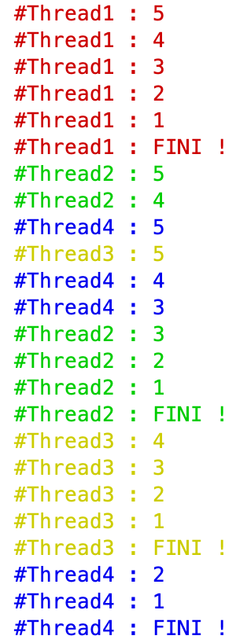
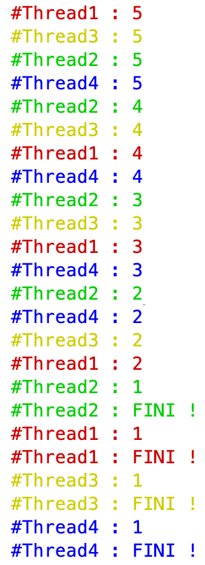

# M3210C - TP3 : Introduction aux threads
> durée : 2h

## Objectif de ce TP
Vous initier aux threads.

## Les threads en Java

Un **thread** est une portion de code pouvant s'exécuter en "parallèle" d'autres threads. En réalité, les threads s'exécutent suivant un temps CPU partagé. Le CPU donne du temps aléatoirement à chacun des threads existant de façon à leur laisser une chance s'exécuter.

En Java, il y a deux façon de créer un thread : en **héritant de la classe Thread** ou en **implémentant l'interface Runnable**

### En héritant de la classe Thread

La classe suivante montre un exemple.

```java
public class ThreadExemple1 extends Thread {
			
    @Override
    public void run() {
        /* Travail du Thread */
        System.out.println("Je suis un thread ThreadExemple1 et mon nom est " + this.getName());
    }

    public static void main(String[] args) {
        ThreadExemple1 t = new ThreadExemple1();
        t.start();
        System.out.println("Je suis le processus principal et mon nom est " + Thread.currentThread().getName());
    }
}
```

La classe ```ThreadExemple1``` hérite (étend) la classe ```Thread``` et redéfinit ("override") la méthode ```run()```.

Dans la méthode ```run()```, on écrit ce que fait le thread.

Pour lancer le thread dans la fonction principale il faut utiliser la méthode ```start()```.

- Testez cette classe. Exécutez la plusieurs fois.

Vous obtenez : 
```
Je suis le processus principal et mon nom est main
Je suis un thread ThreadExemple1 et mon nom est Thread-0
```

ou 

```
Je suis un thread ThreadExemple1 et mon nom est Thread-0
Je suis le processus principal et mon nom est main
```

Vous voyez deux processus : le processus principal (l'exécution de la classe) dont le nom est **main** et le thread créé dont le nom est **Thread-0**.

- Ajoutez d'autres threads à lancer dans la fonction principale pour voir le résulat (relancez plusieurs fois pour voir le côté aléatoire de l'exécution des threads).

```java
public static void main(String[] args) {
        ThreadExemple1 t1 = new ThreadExemple1(); t1.start();
        ThreadExemple1 t2 = new ThreadExemple1(); t2.start();
        ThreadExemple1 t3 = new ThreadExemple1(); t3.start();
        System.out.println("Je suis le processus principal et mon nom est " + Thread.currentThread().getName());
    }
}
```

ou

```java
public static void main(String[] args) {
        new ThreadExemple1().start();
        new ThreadExemple1().start();
        new ThreadExemple1().start();
        System.out.println("Je suis le processus principal et mon nom est " + Thread.currentThread().getName());
    }
}
```

La classe suivante illustre un deuxième exemple avec un constructeur.

```java
public class ThreadExemple2 extends Thread {

    public ThreadExemple2(String nom) {
        super(nom);
    }
    
    @Override
    public void run() {
        /* Travail du Thread */
        System.out.println("Je suis un thread ThreadExemple2 et mon nom est " + this.getName());
    }
    
    public static void main(String[] args) {
        new ThreadExemple2("Will").start();
        new ThreadExemple2("Mickey").start();
        new ThreadExemple2("James").start();
        System.out.println("Je suis le processus principal et mon nom est " + Thread.currentThread().getName());
    }
}
```

- Testez cette classe en l'exécutant plusieurs fois.

### Threads en implémentant l'interface Runnable

- Testez le programme suivant.

```java
public class HelloRunnable implements Runnable {
 
    @Override
    public void run() {
        System.out.println("Hello d'un thread créé à partir d'un Runnable");
    }
 
    public static void main(String args[]) {
      HelloRunnable hr = new HelloRunnable();
      Thread t = new Thread(hr);
      t.start();
    }
}
```

### Allons un peu plus loin


- Pour mettre un peu de couleurs pour différencier vos threads, testez le programme suivant.

```java
public class Testcouleur {
    public static void main(String[] args) {
        for(int i=0; i<10; i++)
            System.out.println("\033[3"+i+"m Avec i = "+i);
    }
}
```

- Testez la classe suivante illustrant un troisième exemple avec des attributs pour la classe (une variable de classe (i.e. une variable commune à toutes les instances), une constante d'instance (chaque instance à sa constante), un constructeur et une redéfinition de la méthode toString (pour afficher plus facilement un Thread).


```java
public class ThreadExemple3 extends Thread {
    
    private static int nbThreads = 1; /* Rappel : c'est une variable de classe (mot clé static)*/
    private final int NUM; /* Rappel : c'est une constante (mot clé final) d'instance (pas le mot clé static)*/

    public ThreadExemple3(String nom) {
        super(nom);
        NUM=nbThreads;
        nbThreads++;
    }
    
    @Override
    public void run() {
        /* Travail du Thread */
        System.out.println(this);
    }
    
    @Override
    public String toString() {
        return "\033[3"+(NUM%10)+"mJe suis #Thread" + getName();
    }
    
    public static void main(String[] args) {
        new ThreadExemple3("Will").start();
        new ThreadExemple3("Mickey").start();
        new ThreadExemple3("James").start();
        System.out.println("Je suis le processus principal et mon nom est " + Thread.currentThread().getName());
    }
}
```

Il est aussi possible de démarrer un thread dès sa construction

- Créer une nouvelle classe ThreadExemple4 faisant la même chose que la classe ThreadExemple3 mais utilisant le constructeur suivant

```java
public ThreadExemple4(String nom) {
    super(nom);
    NUM=nbThreads;
    nbThreads++;
    this.start();
}
```

Vous remarquez que l'IDE vous met un message d'avertissement "***Starting a new Thread in constructor is dangerous and should be prevented.***" (vous ne le ferez que pour gagner du temps sur vos tests).


- Testez la classe suivante

```java
public class ThreadCompteur extends Thread {
    
    private int cr = 5;
    private static int nbThreads = 1;
    private final int NUM;

    public ThreadCompteur() {
        super("" + nbThreads);
        NUM=nbThreads;
        nbThreads++;
        this.start();
    }

    @Override
    public String toString() {
        return "\033[3"+(NUM%10)+"m #Thread" + getName() + " : " + cr;
    }

    @Override
    public void run() {
        while (true) {
            System.out.println(this);
            if (--cr == 0) {
                System.out.println("\033[3"+(NUM%10)+"m "
                        + "#Thread" + getName() + " : FINI !");
                return;
            }
        }
    }

    public static void main(String[] args) {
        for (int i = 1; i < 5; i++) {
            new ThreadCompteur();
        }
    }
}
```

:::tip 
Remarquez quelques éléments un peu technique : (1) --cr == 0 décrémente cr avant de tester si cr vaut 0, et (2) emploi du return pour stopper le thread (fin méthode run()).
:::

- Que fait chaque thread ThreadCompteur ? Relancez plusieurs fois cette classe ThreadCompteur

On peut obtenir quelque chose comme ceci :

 

Comment faire si on veut que les threads comptent à rebours en même temps c'est-à-dire qu'on obtienne toujours le même résultat suivant :

 

Une façon de faire consiste à endormir un thread pour laisser du temps aux autres. Pour ce faire vous pouvez utilisez la méthode sleep (public static void sleep(long millis) throws InterruptedException) comme ceci :

```java
try {
	this.sleep(100); // thread endormi 100ms
} catch (InterruptedException e) {
	System.err.println("Exception : "+e);;
}
```

- Créez une classe **ThreadCompteurv2** donnant un résultat où tous les threads comptent à rebours en même temps.

**Remarque** : il existe aussi la méthode **yield** (public static void yield()) indiquant que le thread "peut laisser la main" à un autre thread (l'ordonnanceur des threads n'est pas obligé de le respecter).

- Testez votre classe avec un **yield** à la place du **sleep**.

Vous disposez également de la méthode **join** (public final void join() throws InterruptedException "Waits for this thread to die") permettant d'attendre qu'un thread ait fini. Exemple :

```java
t1.join();
/* Le code ci-après ne s'exécutera que quand t1 aura fini.*/
```

Pour permettre l'exécution d'un bloc de code par un thread sans qu'il ne soit interrompu par un autre thread, vous avez le mot clé synchronized.

Il peut s'appliquer sur une méthode :


```java 
synchronized void methode() { /* une méthode synchronisée / accès bloqué pour les autres méthodes synchronisées */}
```

Lorsque vous appelez une méthode d'instance synchronisée, cet objet est bloqué et aucune autre méthode synchronisée de cet objet ne peut être appelée avant la fin de l'excution de cette méthode.

:::danger Attention
Attention une méthode non synchronisée ou du code non synchronisé peut venir exécuter un bloc synchronisé ou une méthode synchronisée...
:::

On peut aussi déclarer un bloc d'instructions comme étant synchronisé :

```java
synchronized(objectidentifier) {
   /* Accès bloqué pour les autres méthodes synchronisées */ 
}
```
